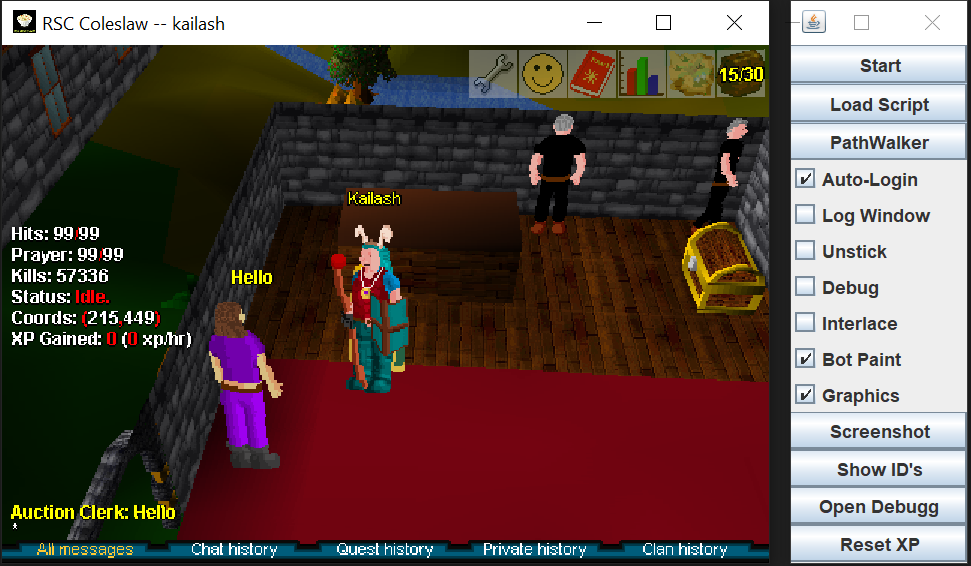
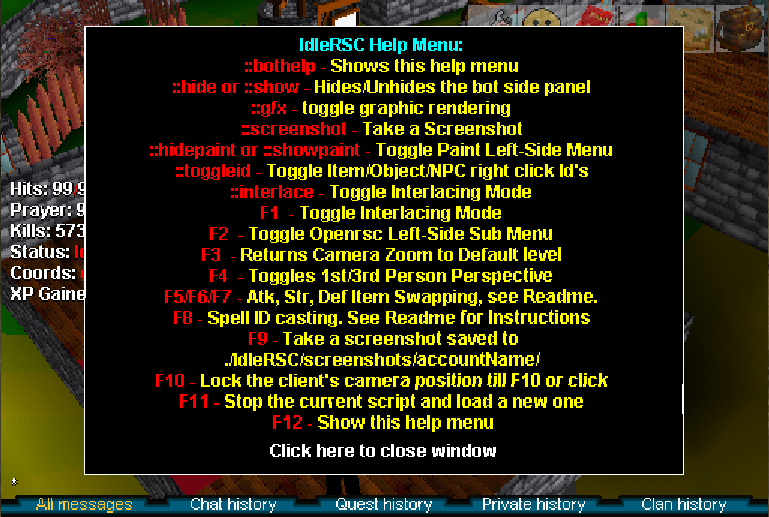

# IdleRSC

IdleRSC is a bot for [Open RSC][open-rsc]. It uses code injection and
reflection. It has it's own custom scripting API called IdleScript, as well as
backwards compatibility with APOS and SBot scripts. It also provides staker
bot functionality!



## Starting IdleRSC

---
Releases are automatically generated upon every commit to the GitLab
[repository][repository], the last successful build can be downloaded
[here][download]. Javadoc can be found [here][github-pages]

1. Modify run.bat/sh.
1. Select which server you want.
1. **Optional**: if playing on a different server which allows botting,
   modify Cache/ip.txt and Cache/port.txt if needed.
1. Run .bat/.sh file!

## Commands

---


### In-game

* `::bothelp` - show help menu with all in-game commands & keyboard shortcuts
* `::show` - show the bot side-pane
* `::gfx` - toggle graphics rendering
* `::screenshot` - take a screenshot
* `::hidepaint`/`::showpaint` - toggle paint left-side menu
* `::toggleid` - toggle item/object/npc IDs on right-click
* `::interlace` - toggle graphics interlacing

### Shortcuts

* `F1` - toggle graphics interlacing
* `F2` - toggle left-side sub menu
* `F3` - return camera zoom to default setting
* `F4` - toggles between first & third person view
* `F5`/`F6`/`F7` - attack/defense/strength item swapping (stake switching)
* `F8` - spell id casting
* `F9` - take a screenshot
* `F10` - lock the client's camera position until `F10` is pressed or
  mouse click
* `F11` - stop the current script and load a new one
* `F12` - show help menu with all in-game commands & keyboard shortcuts

### CLI Startup Commands

---
Command Line Interface (CLI) commands can be included following a command line startup
for example `java -jar IdleRSC.jar` , or added to the `run_windows.bat`or `run_linux.sh`
script files that execute the same startup command.

* `--auto-start` - Auto start bot, bypassing Account Selection window
  * Must include either:
    * `--account`
    * `--username` and `--password`
* `--account <account>` - Load from saved account
* `--script-arguments <arguments>` - pass arguments to the script (e.g. dragonstone)
* `--auto-login` - Enable automatic log-in with credentials (--username, --password)
* `--debug` - Enable debug logging
* `--log-window` - Display log window
* `--disable-gfx` - Disable graphics refresh
* `--help` - Show help menu (F12)
* `--hide-side-panel` - Hide side panel
* `--init-cache <server>` - Initialise cache for specified server (coleslaw|uranium)
* `--interlace` - Enable graphics interlacing
* `--local-ocr` - Enable local OCR
* `--log-window` - Display log window
* `--script-name <name>` - Name of the script to run
* `--password <password>` - Account password
* `--script-selector` - Display script selector window
* `--username <username>` - Account username
* `--unstick` - Unstick side panel from main window
* `--version` - Show version
* `--attack-items <item1,item2>` - stake switcher attack item swapping
* `--defence-items <item1,item2>` - stake switcher defence items swapping
* `--strength-items <item1,item2>` - stake switcher strength items swapping
* `--spell-id <id>` - Spell id for stake switcher casting

### Stake Switcher

The stake switcher can only be configured by use of command-line parameters.
Inside your `run_windows.bat` or `run_linux.sh` script, add the following
lines:

```
--attack-items 123,456
--strength-items 123,456
--defence-items 123,456
--spell-id 2
```

e.g. `java -jar IdleRSC.jar --attack-items 123,456` and so on.

Restart the bot. Press `F5`, `F6`, `F7`, `F8` to validate.

## Rules

---

User will NOT use this client to bot on non-botting servers. The only
allowed openRSC botting servers are Coleslaw and Uranium. Use of this
client to bot on Cabbage or Preservation will result in a BAN of the
accounts.

## Sleeping

---

Note: The below paragraph is out of date. The sleeper server no longer
runs, and the local OCR functionality has not *yet* been tested by the
current developers.

IdleRSC uses a sleeper server which is provided free of charge. However,
if you would like, you can run the FOCR sleeper locally with --localOCR
on the command line. Get the latest copy of FOCR [here][focr].

## Account Security

---

Please be aware that run.bat is not encrypted. If someone has your
run.bat, they have your username and password.
Please be aware that you should not run any .class files from sources
you do not trust. Running a rogue .class file is akin to running a .exe
file on your computer. IF YOU DON'T TRUST IT, READ THE SOURCE CODE AND
COMPILE IT!!!

### Lost Items, Accounts, etc

Developers of IdleRSC are not responsible for ruined, banned, hacked accounts,
or anything else.

## Compiling Scripts

---

### Linux

1. Put the .java file in the src/scripting/(idlescript or sbot) folder
2. Run `./gradlew build`

### Windows

#### Native Scripts and SBot: (Eclipse Method)

1. Open up the project in Eclipse
2. Add a new script to the `scripting` package.
3. Compile Jar with (compile_windows.bat) or (compile_linux.sh)
4. Run client with (run_windows.bat) or (run_linux.sh)

#### Native Scripts and SBot: (IntelliJ Gradle Method)

1. Open up the project in IntelliJ
2. Save all script changes
3. Build project Class files with Gradle "Build Project"
4. Compile Jar with (compile_windows.bat) or (compile_linux.sh)
5. run client with (run_windows.bat) or (run_linux.sh)

#### APOS/SBot

Easy Method: (NOT PREFERRED IF YOU ARE WANTING TO DEVELOP SCRIPTS)
WARNING: This will delete your JAR file!!!

1. Place your script in src/scripting/apos/
2. Run compile_windows.bat (or compile_linux.sh)
3. Ensure no issues compiling (they will be towards the top.)
4. Re-run the bat file.

Read "converting SBot scripts" section for compilitation issues.

## Converting Scripts

---

### Converting APOS Scripts

APOS scripts require several changes in order to be made compatible.
Please see changes made to scripts which were added.

### Converting SBot Scripts

1. Open SBot script in a text editor.
2. Place these lines at the top of the file:

```
package scripting.sbot;
import compatibility.sbot.Script;
```

3. Remove the mudclient constructor. For example, for alch.java, you would want to remove the following lines:

```
public alch(mudclient rs)
{
  super(rs);
}
```

4. Compile using Eclipse or IntelliJ Gradle (preferred) or the included compilation script (compile_windows.bat)

## Compiling IdleRSC.jar

---

1. Clone the repository from [GitLab](https://gitlab.com/open-runescape-classic/idlersc).
2. Open the project in Eclipse or IntelliJ, set up eclipse or gradle (preferred) compiler.
3. If client JAR is out of date, run patcher utility from the Gitlab [repository](https://gitlab.com/open-runescape-classic/tools/idlersc_patcher) (follow README in that project).
  - Only typically necessary when a server-side update adds sprites/textures/etc.
4. Test the compile process:
  a. Save all script changes
  b. "Build" project Class files with Gradle Build or Eclipse
  c. Compile Jar with (compile_windows.bat) or (compile_linux.sh)
  d. run client with (run_windows.bat) or (run_linux.sh)

If you have problems, you can create a new issue or ask for help in the OpenRSC Discord.


## Contributing

---

* Please submit issues, questions, bugs on GitLab's [issue tracker][issue-tracker].
* Provide stack traces for crashes, etc.
* Please submit pull requests to [GitLab][merge-requests].

## Discussion

---

Please join the [OpenRSC discord][discord] and post in the
`#botting-client-development` channel. Other channels are not tied to botting,
so please do not discuss botting in those channels.

## Donations

---

Like [Open RSC][open-rsc], donations are not accepted. IdleRSC is
provided for free under [GPLv3](LICENSE), due to passion for RSC botting.

## About

---

This started as a project in April 2020 due to a distinct lack of botting
clients available for RSC post-closure. After Jagex decided to nerf the
blowpipe in OSRS, the original coder gained renewed interest in January 2021,
and the project was resurrected and released.

The original owner is no longer part of this fork of the project. However,
credit for writing the original client goes to DvorakKeys.
Credit also goes to many developers including but not limited to:
Damrau, Grawlinson, JonathanB31, Kaila Btw, Kkoemets, Searos, and Seatta.

The RSC botting scene WILL NEVER DIE! IdleRSC is the next iteration after
APOS, STS, SBot, and AutoRune!

[github-pages]: https://open-runescape-classic.gitlab.io/idlersc
[open-rsc]: https://rsc.vet
[repository]: https://gitlab.com/open-runescape-classic/idlersc
[issue-tracker]: https://gitlab.com/open-runescape-classic/idlersc/-/issues
[merge-requests]: https://gitlab.com/open-runescape-classic/idlersc/-/merge_requests
[discord]: https://discord.gg/CutQxDZ8Np
[focr]: https://gitlab.com/open-runescape-classic/tools/focr-resurrection
[download]: https://gitlab.com/open-runescape-classic/idlersc/-/jobs/artifacts/master/browse?job=build
