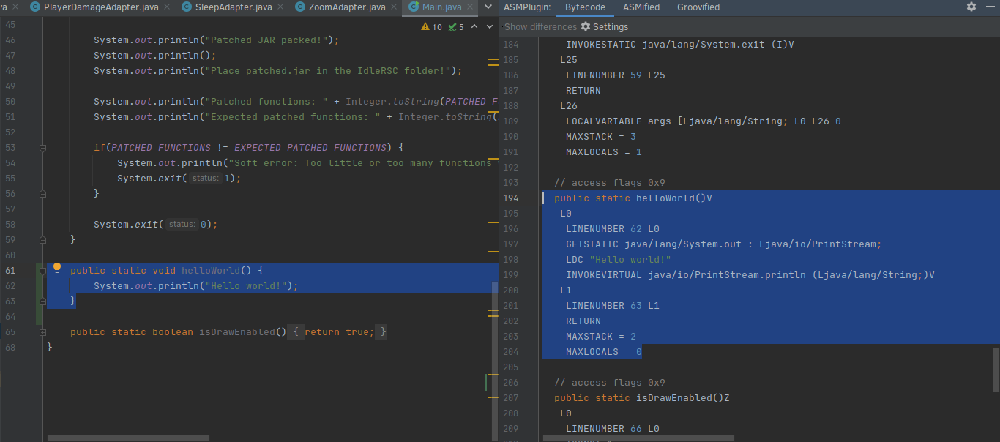
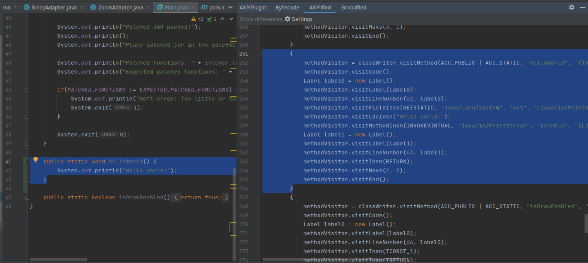

# IdleRSC Patcher

This project takes the Open RSC client jar archive and then patches various
methods inside of it. This is necessary for more complex functionality which
requires callbacks to IdleRSC, such as painting progress reports on the screen
every game frame, or detecting hitsplats.

This patcher is required to be ran by the project maintainer every time that a
new OpenRSC release is made which results in a client break.

## Compiling

Run the gradle task `build` via the top-level wrapper or system gradle.

## How To Run

Run `patcher.jar` via `java -jar patcher.jar source.jar destination.jar`, where
`source.jar` is the unpatched Open RSC client jar archive and `destination.jar`
is the location to place the patched jar archive.

If there are any errors after replacing the patched jar archive, IdleRSC may
need to be recompiled against the patched jar archive.

## Adding new patches

Before adding patches, it is helpful to know how the patcher actually works at
a high level:

1. It unzips the jar.
1. It reads the class files.
1. The ASM library is then used to read or modify bytecode.
   [MasterAdapter](src/main/java/patcher/MasterAdapter.java) looks at the
   function names in the class and then passes it along to the appropriate
   "patch adapter" function.
1. For example, Open RSC's **mudclient.showMessage** is passed to
   [MessageAdapter](src/main/java/patcher/hookers/MessageAdapter.java).
1. The adapter makes the changes to the class file in memory.
1. The raw class bytecode is then saved to the class file on disk.
1. The jar is then re-zipped using the modified classes.

Therefore, if you want to add a new patch, you need to:

1. Add a new `if` statement in [MasterAdapter](src/main/java/patcher/MasterAdapter.java)
1. Add a new `XyzAdapter` in `patcher.hookers`.

However, you still need to determine what bytecode/ASM code to throw into your
`XyzAdapter`. To do this, you need to install IntelliJ's [ASM Bytecode Viewer](https://plugins.jetbrains.com/plugin/10302-asm-bytecode-viewer).
The plugin will allow you to write Java code and then view the bytecode or the
corresponding ASMified bytecode.

For example, here are two pictures of "Hello World" being decoded by the viewer:

From here, it is up to you to learn how to take the ASMified portion of this
code and then integrate it into the adapter. There are plenty of examples in
`patcher.hookers`!
